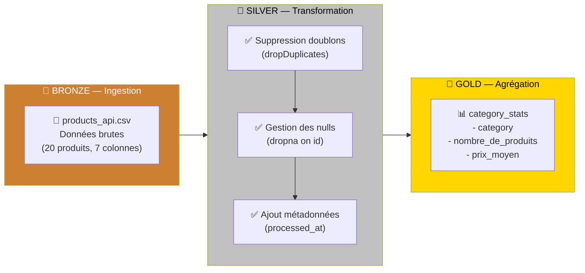
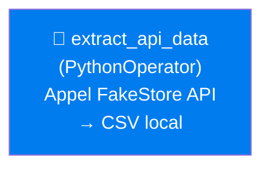
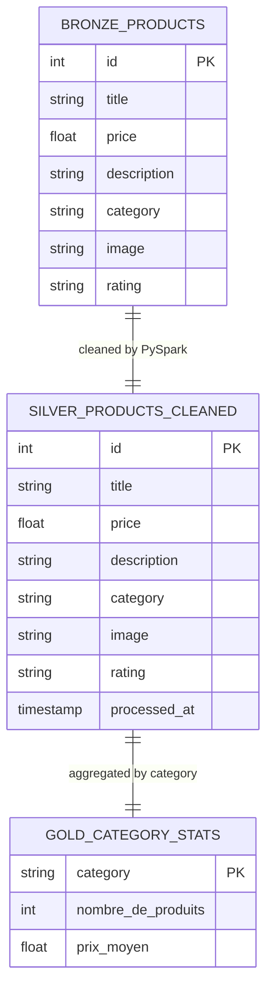

# 🛒 E-Commerce Data Engineering Pipeline (Azure & Databricks)

<div align="center">


</div>

## 📝 Présentation du Projet

Ce projet est un pipeline **End-to-End de Data Engineering** construit sur le Cloud **Microsoft Azure**. Il extrait des données e-commerce depuis la [FakeStore API](https://fakestoreapi.com/), les ingère dans un **Azure Data Lake Storage Gen2**, et les transforme via **Azure Databricks** et **PySpark** selon l'architecture **Medallion** (Bronze → Silver → Gold). Les données agrégées sont visualisées dans **Power BI**.

> 📦 **Source de données :** [FakeStore API](https://fakestoreapi.com/) — 20 produits répartis en 4 catégories (vêtements homme/femme, bijoux, électronique).

---

## 🔍 Insights Clés

Après traitement des données, voici les principales observations :

**Répartition par catégorie :**
- 🖥️ La catégorie **Electronics** regroupe les produits les plus chers (prix moyen > 500$)
- 💍 La catégorie **Jewelery** affiche les meilleurs ratings clients
- 👔 Les vêtements représentent la majorité des produits en volume

**Top produits :**
- Le produit le plus cher est le **Samsung 49" Gaming Monitor** à 999,99$
- Le produit le moins cher est la **bague White Gold Plated Princess** à 9,99$
- Le meilleur rating est obtenu par le **SSD Silicon Power 256GB** (4.8/5)

---

## 🏗️ Architecture du Projet

L'architecture end-to-end suit les étapes suivantes :

1. **Extraction** — Récupération des données JSON depuis la FakeStore API via `src/extract.py`
2. **Ingestion (Bronze)** — Téléversement du CSV brut vers Azure Data Lake Gen2 via `src/load.py`
3. **Transformation (Silver)** — Nettoyage PySpark : dédoublonnage, gestion des nulls, ajout de métadonnées (`processed_at`), sauvegarde Delta
4. **Agrégation (Gold)** — Calcul du `nombre_de_produits` et `prix_moyen` par catégorie, sauvegarde Delta
5. **Orchestration** — DAG Apache Airflow pour automatiser l'extraction quotidienne
6. **Visualisation** — Connexion Power BI à la couche Gold pour les tableaux de bord

```mermaid
flowchart LR
    A["🌐 FakeStore API\n(REST JSON)"] -->|"extract.py\n(requests)"| B["📄 raw_products.csv\n(Local)"]
    B -->|"load.py\n(azure-storage-file-datalake)"| C["☁️ Azure Data Lake Gen2\n🥉 Bronze Container"]
    C -->|"Databricks / PySpark\nRead CSV"| D["🥈 Silver Layer\nDelta Format\n(cleaned + processed_at)"]
    D -->|"groupBy category\nagg count + avg price"| E["🥇 Gold Layer\nDelta Format\n(category_stats)"]
    E -->|"Power BI\nDirect Query"| F["📊 Dashboard\nPower BI"]

    G["⏰ Apache Airflow\n(DAG @daily)"] -.->|"orchestrates"| A

    style A fill:#4A90D9,color:#fff
    style B fill:#7B7B7B,color:#fff
    style C fill:#CD7F32,color:#fff
    style D fill:#C0C0C0,color:#000
    style E fill:#FFD700,color:#000
    style F fill:#F2C811,color:#000
    style G fill:#017CEE,color:#fff
```



---

## 🏅 Architecture Medallion (Data Lakehouse)



| Couche | Format | Contenu | Chemin ADLS |
|--------|--------|---------|-------------|
| 🥉 Bronze | CSV | Données brutes de l'API | `bronze/raw_data/products_api.csv` |
| 🥈 Silver | Delta | Données nettoyées + `processed_at` | `silver/products_cleaned/` |
| 🥇 Gold | Delta | Agrégats par catégorie | `gold/category_stats/` |

---

## 🔄 Pipeline sur Airflow

Le DAG `azure_ecommerce_pipeline` s'exécute quotidiennement (`@daily`) et orchestre l'ensemble du pipeline :



> 💡 Le DAG est conçu pour être extensible : les tâches `upload_to_azure` et `run_databricks_notebook` peuvent être ajoutées pour automatiser les étapes suivantes.

---

## 📐 Modèle de Données (Couche Gold)

La couche Gold produit une table agrégée optimisée pour la visualisation :



---

## 📊 Tableau de Bord Power BI

> 🚧 **En cours de développement**

<!--
TODO - POWER BI (à faire après le pipeline) :
1. Ouvrir Power BI Desktop
2. Se connecter à la couche Gold sur Azure Data Lake Gen2 (format Delta)
   → Source : abfss://gold@datalakefodi2026.dfs.core.windows.net/category_stats
3. Créer les visuels suivants :
   - 📈 Histogramme : Prix moyen par catégorie
   - 📦 Graphique en anneau : Nombre de produits par catégorie
   - 🏆 Tableau : Top produits par rating (depuis la couche Silver)
   - 💰 Boxplot ou histogramme : Distribution des prix
4. Publier sur Power BI Service
5. Faire une capture d'écran du dashboard final
6. Remplacer cette section par : 
-->

---

## 🛠️ Technologies Utilisées

| Catégorie | Technologie | Usage |
|-----------|-------------|-------|
| **Cloud** | Microsoft Azure | Provider principal |
| **Stockage** | Azure Data Lake Gen2 | Data Lake (Bronze/Silver/Gold) |
| **Transformation** | Azure Databricks + PySpark | Traitement distribué |
| **Format** | Delta Lake | Stockage optimisé (ACID) |
| **Orchestration** | Apache Airflow | Planification des tâches |
| **Langage** | Python 3 | Scripts d'extraction/chargement |
| **Visualisation** | Power BI | Dashboards interactifs |
| **API Source** | FakeStore API | Données e-commerce de test |
| **Versionnement** | Git & GitHub | Gestion du code |

---

## 📁 Structure du Projet

```
azure-databricks-ecommerce-pipeline/
├── 📁 dags/
│   └── ecommerce_pipeline.py     # DAG Airflow (@daily)
├── 📁 data/
│   └── raw_products.csv          # Données brutes extraites de l'API
├── 📁 notebooks/
│   └── 01_bronze_to_silver.py    # Notebook Databricks (Bronze → Silver → Gold)
├── 📁 src/
│   ├── extract.py                # Extraction depuis FakeStore API
│   └── load.py                   # Upload vers Azure Data Lake Gen2
├── 📁 config/                    # Configuration (à compléter)
├── .env                          # Variables d'environnement (non versionné)
├── requirements.txt              # Dépendances Python
└── README.md
```

---

## 🚀 Comment Exécuter ce Projet

### Prérequis

- Un compte **Microsoft Azure** avec un ADLS Gen2 et 3 conteneurs : `bronze`, `silver`, `gold`
- Un espace de travail **Azure Databricks** avec un cluster actif
- **Python 3.x** installé localement
- **Apache Airflow** (optionnel, pour l'orchestration)

### Étapes de Déploiement

**1. Cloner le dépôt**
```bash
git clone https://github.com/FODI10/azure-databricks-ecommerce-pipeline.git
cd azure-databricks-ecommerce-pipeline
```

**2. Installer les dépendances**
```bash
pip install -r requirements.txt
```

**3. Configurer les variables d'environnement**

Créer un fichier `.env` à la racine :
```env
AZURE_STORAGE_CONNECTION_STRING=DefaultEndpointsProtocol=https;AccountName=...
```

**4. Extraire les données depuis l'API**
```bash
python src/extract.py
# → Génère data/raw_products.csv avec 20 produits
```

**5. Uploader vers Azure Data Lake (couche Bronze)**
```bash
python src/load.py
# → Envoie raw_products.csv dans bronze/raw_data/products_api.csv
```

**6. Exécuter le Notebook Databricks**

Importer et exécuter `notebooks/01_bronze_to_silver.py` sur votre cluster Databricks pour :
- Lire depuis la couche Bronze
- Nettoyer et sauvegarder en Silver (Delta)
- Agréger et sauvegarder en Gold (Delta)

**7. (Optionnel) Lancer Airflow**
```bash
airflow dags trigger azure_ecommerce_pipeline
```

---

## 👤 Auteur

**FODI10** — [GitHub](https://github.com/FODI10)

